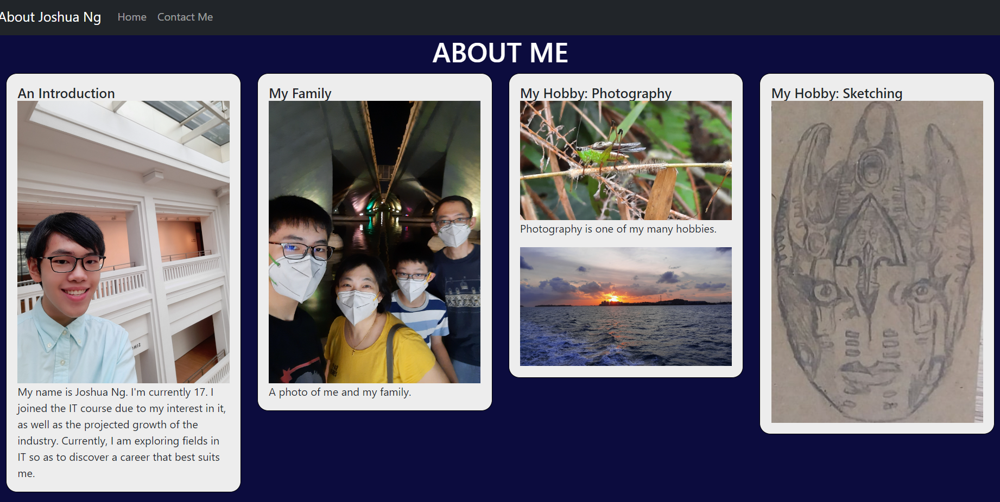

NOTE: I mistakenly believed the GitHub blog was not working and thus did not submit the blog posts I have made thus far. (Week 2-9)

This week’s content introduces Bootstrap, a library that provides a convenient, simplified method of site development.

